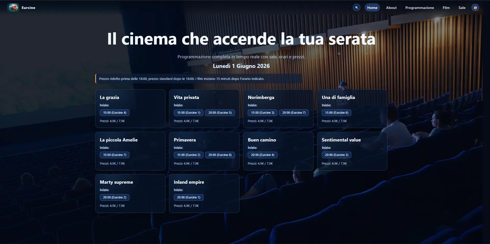
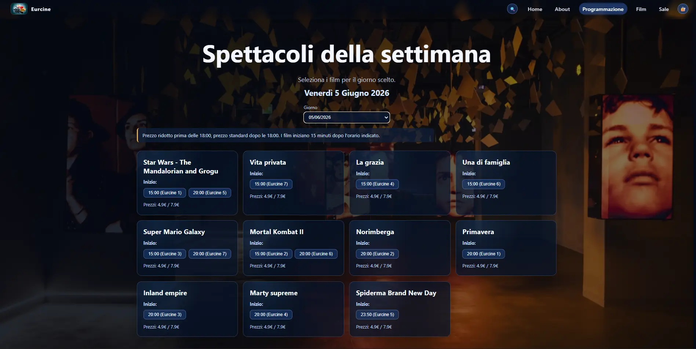
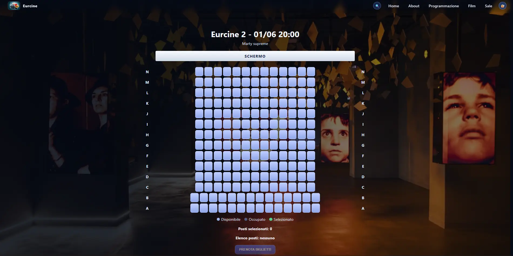
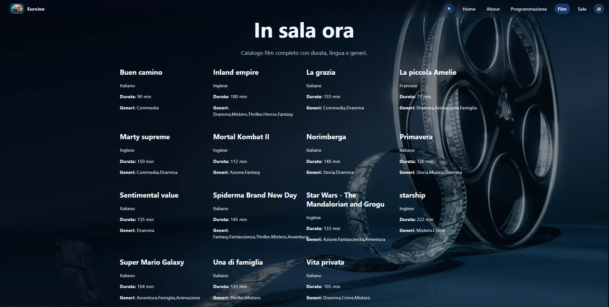
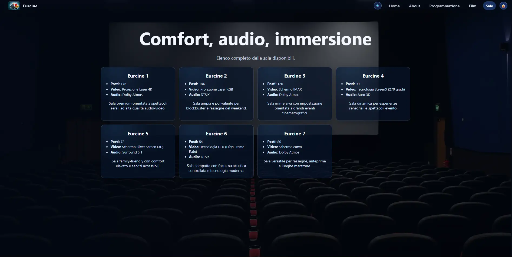
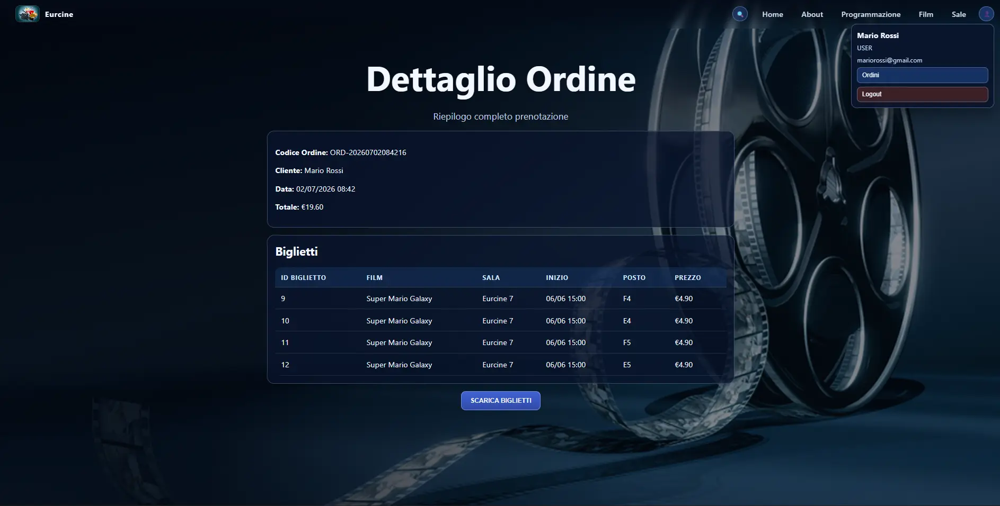
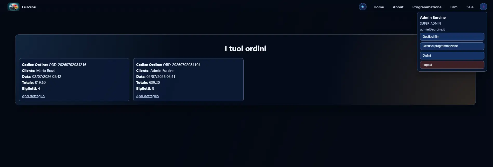
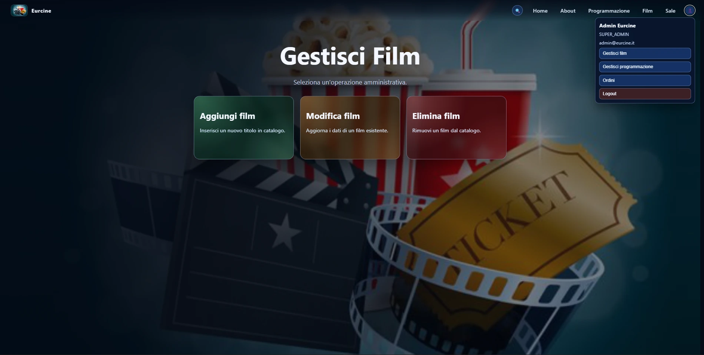
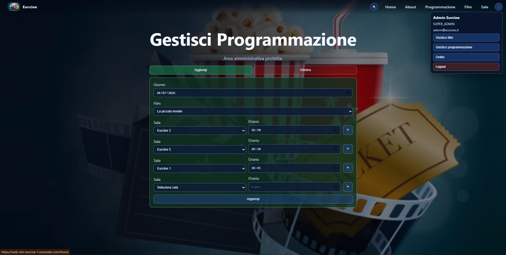

# 🎬 EurCine — Sito Cinema Didattico

Progetto creato **per divertimento** e per testare concretamente l'uso di agenti AI come **CODEX** nella scrittura di codice a partire da specifiche tecniche dettagliate. L'idea, l'architettura, il design del dominio e tutte le decisioni tecniche sono state fatte da me — CODEX si è occupato della scrittura del codice e dei test.

Il risultato? Il sito completo è stato realizzato in **2/3 giorni**, poi rifinito e stabilizzato dopo il primo deploy. Un esperimento riuscito, e pure divertente.

🔗 **Live:** [https://web-site-eurcine-1.onrender.com/home](https://web-site-eurcine-1.onrender.com/home)

⏱️ **Nota:** in produzione il backend gira in modalità **read-only**. Le modifiche fatte dall'utente o dall'admin non toccano il DB condiviso: finiscono solo nella sandbox locale della sessione browser (`sessionStorage`) e spariscono alla chiusura della sessione/tab.

---

## 🧱 Stack Tecnologico

### Backend
| Tecnologia | Versione |
|---|---|
| ☕ Java | 21 |
| 🌱 Spring Boot | 4.0.6 |
| 🗄️ Spring Data JPA + Hibernate | — |
| 🔐 Spring Security + JWT (jjwt) | 0.12.6 |
| 🐬 MySQL | — |
| 🦋 Flyway | migrations versionate |
| 📖 SpringDoc OpenAPI (Swagger) | 2.8.9 |
| 🏗️ Lombok | — |
| 🐳 Docker | multi-stage build |

### Frontend
| Tecnologia | Versione |
|---|---|
| 🅰️ Angular | 21.2 |
| 🖥️ Angular SSR | 21.2 (Express 5) |
| 🎨 SCSS | — |
| 🧪 Vitest | 4.x |
| 💅 Prettier | 3.x |

### Infrastruttura (produzione)
| Servizio | Utilizzo |
|---|---|
| ☁️ Render | Hosting backend (Docker) + frontend |
| 🐬 Aiven.io | MySQL cloud gratuito |

---

## 🎭 Cosa puoi fare sul sito

Il sito simula un cinema reale con le funzionalità principali:

- 🎥 **Sfogliare i film** in programmazione e leggere le trame
- 📅 **Vedere la programmazione settimanale** con orari e sale
- 🪑 **Selezionare i posti** direttamente sulla mappa interattiva della sala
- 🎟️ **Acquistare biglietti** (prezzi differenziati pre/post 18:00; in produzione l'acquisto è simulato nella sessione)
- 👤 **Registrarsi** e creare il proprio account cliente
- 📦 **Consultare i propri ordini** nell'area personale
- 🏛️ **Esplorare le sale** con caratteristiche tecniche (Dolby Atmos, 4DX, IMAX, ecc.)

### Area Admin 🔑

Esiste un'area amministrativa protetta per gestire, in locale, le seguenti operazioni:
- Aggiungere, modificare ed eliminare film
- Gestire la programmazione settimanale
- Visionare gli ordini di ogni utente registrato

**Credenziali di accesso admin:**
```text
Email:    admin@eurcine.it
Password: admin123
```

> 🔒 **Il database di produzione non è modificabile dall'applicazione.** Il profilo `prod` abilita Flyway, imposta Hibernate in `validate` e blocca tutte le richieste mutative prima che raggiungano service e repository.
>
> In produzione le operazioni di scrittura dell'utente e dell'admin vengono simulate nella sandbox del browser (`sessionStorage`): non cambiano il DB condiviso e si perdono chiudendo tab o browser. Le migration Flyway sono l'unico flusso autorizzato per aggiornare lo schema.

---

## 🔒 Security

Il backend implementa un layer di sicurezza su più livelli.

### Autenticazione e sandbox di sessione
In produzione l'app usa una modalità ibrida:
- le letture pubbliche e i cataloghi continuano a passare dal backend
- autenticazione, registrazione, ordini e scritture admin vengono gestiti nella sandbox del frontend quando la sessione browser è attiva
- le richieste mutative eventualmente inviate al backend vengono bloccate lato backend
- il token, lo stato mock e le cache della sandbox vivono in `sessionStorage`, quindi si azzerano alla chiusura del browser/tab
- ogni scheda ha la propria sessione locale: aprire una nuova tab significa ripartire da zero

Il backend resta stateless e continua a validare identità e ruoli per le route reali.

### Autorizzazione per ruolo
Le route sono protette a livello di `SecurityFilterChain`:
- `/api/ordini/**` → richiede autenticazione
- `/api/admin/**` → richiede ruolo `ADMIN` o `SUPER_ADMIN`
- Il resto delle API pubbliche (film, sale, programmazione) è accessibile senza autenticazione

HTTP Basic e form login sono **esplicitamente disabilitati**.

### SQL Injection
Tutta l'interazione col database passa attraverso **Spring Data JPA** con query parametrizzate (JPQL e query derivate). In più, i principali input utente hanno validazioni server-side e il profilo `prod` blocca ogni mutazione del DB, così in produzione i dati restano sempre protetti in sola lettura.

### CORS
Le origin autorizzate sono configurate tramite variabile d'ambiente (`CORS_ALLOWED_ORIGINS`). In produzione punta esclusivamente al dominio del frontend su Render — richieste da altri domini vengono bloccate a livello di preflight.

### Swagger UI — solo locale
La Swagger UI (`/swagger-ui.html`) è attiva **solo in locale**, dove potete usarla per testare gli endpoint, fare verifiche manuali e penetration test sull'API. In produzione (profilo `prod`) è disabilitata:

```properties
# application-prod.properties
springdoc.api-docs.enabled=false
springdoc.swagger-ui.enabled=false
```

In locale è raggiungibile su `http://localhost:8080/swagger-ui.html`.

---

## 🗃️ Database — Hibernate e Flyway

Il progetto usa **due meccanismi distinti** per la gestione dello schema, con comportamenti diversi a seconda dell'ambiente.

### Come funzionano insieme

**Hibernate** (`spring.jpa.hibernate.ddl-auto`) controlla se Hibernate può modificare lo schema del DB:
- `update` — Hibernate crea/aggiorna le tabelle confrontando le entity JPA con lo schema attuale. Utile in locale per sviluppo rapido, non adatto per produzione.
- `validate` — Hibernate non tocca nulla: controlla solo che lo schema esistente sia coerente con le entity. Se c'è una discrepanza, l'avvio fallisce. Usato in produzione.
- `none` — Hibernate non fa niente sullo schema.

**Flyway** (`spring.flyway.enabled`) esegue le migration SQL versionate in `db/migration/` all'avvio dell'applicazione:
- Ogni script `V{n}__descrizione.sql` viene eseguito una sola volta, in ordine, e tracciato nella tabella `flyway_schema_history`.
- Se uno script è già stato applicato, Flyway lo salta.
- Gestisce sia la creazione dello schema che il seed dei dati (film, sale, programmazione, admin).
- Una migration già applicata è immutabile: non va modificata, perché il checksum registrato non corrisponderebbe più al file.
- Ogni modifica successiva allo schema o ai dati va introdotta con un nuovo script versionato (`V9`, `V10`, ...).

### Regola da seguire: non usarli contemporaneamente

Se Flyway è abilitato (`flyway.enabled=true`), imposta **sempre** `ddl-auto=validate` o `ddl-auto=none`. Se li usi entrambi attivi con `ddl-auto=update`, Hibernate e Flyway possono entrare in conflitto modificando lo schema in modo incoerente.

### Configurazione per ambiente

| | Locale (default) | Locale con Flyway | Produzione |
|---|---|---|---|
| `ddl-auto` | `validate` | `validate` | `validate` |
| `flyway.enabled` | `false` | `true` | `true` |
| `app.read-only-mode` | `false` | `false` | `true` |
| Risultato | Hibernate controlla uno schema già esistente, senza migration o seed | Flyway esegue V1–V8 e Hibernate verifica lo schema | Flyway gestisce tutto, Hibernate solo controlla, scritture bloccate |

### Script di migration

| Script | Contenuto |
|---|---|
| `V1__create_schema.sql` | Struttura completa di tutte le tabelle |
| `V2__seed_admin.sql` | Inserimento admin di default |
| `V3__seed_film.sql` | Catalogo film con generi e lingue |
| `V4__seed_sale.sql` | Sale cinema con file, posti e caratteristiche tecniche |
| `V5__seed_programmazione_daily.sql` | Programmazione giornaliera di esempio |
| `V6__seed_programmazione_weekly.sql` | Programmazione settimanale estesa |
| `V7__add_cliente_and_order_user_fk.sql` | Tabella cliente e FK ordini |
| `V8__update_admin_password_hash.sql` | Aggiornamento idempotente dell'hash password admin |

---

## 🏠 Run in Locale

### Prerequisiti
- **Java 21**
- **Maven** (o usa `./mvnw` incluso nel progetto)
- **MySQL** installato e in esecuzione su porta `3306`
- **Node.js** + **npm 11+** per il frontend

### 1. Configurare il Backend

Copia il file di esempio e rinominalo:

```bash
cd backend/src/main/resources
cp application-example.properties application.properties
```

Per un ambiente locale completo con schema e dati gestiti da Flyway, imposta:

```properties
spring.datasource.url=jdbc:mysql://127.0.0.1:3306/eurcine?createDatabaseIfNotExist=true&serverTimezone=UTC
spring.datasource.username=root
spring.datasource.password=root
app.cors.allowed-origins=http://localhost:4200
app.jwt.secret=change-this-example-secret-at-least-32-characters
app.jwt.expiration-days=7

# Locale con Flyway: Flyway gestisce schema e seed, Hibernate verifica soltanto
spring.jpa.hibernate.ddl-auto=validate
spring.flyway.enabled=true
app.read-only-mode=false
```

> Se il tuo MySQL ha credenziali diverse, modifica `spring.datasource.username` e `spring.datasource.password`.

**Vuoi invece una modalità locale rapida senza Flyway e senza seed**? Usa questa configurazione alternativa:

```properties
spring.jpa.hibernate.ddl-auto=update
spring.flyway.enabled=false
```

Con la modalità Flyway, gli script V1–V8 vengono eseguiti al primo avvio e il DB viene popolato con i dati previsti.

### 2. Avviare il Backend

```bash
cd backend
./mvnw spring-boot:run
```

Backend su `http://localhost:8080`.  
Swagger UI su `http://localhost:8080/swagger-ui.html`.

### 3. Avviare il Frontend

```bash
cd frontend
npm install
npm start
```

Frontend su `http://localhost:4200`.

### Workflow locale vs produzione

- In locale il frontend parla al backend reale: login, registrazione, ordini e admin usano le API vere.
- In produzione le richieste GET continuano a usare il backend reale; login, registrazione, ordini e modifiche admin vengono emulate nel browser con `sessionStorage`.
- Il backend risponde `405` alle richieste mutative, mentre il DB resta protetto in read-only e non viene toccato dall'applicazione.
- Se chiudi la tab o il browser, lo stato mock della sessione viene perso. Aprendo una nuova scheda riparti pulito.

---

## ☁️ Deploy in Produzione (Render + Aiven)

In produzione il backend usa il profilo `prod` (`application-prod.properties`), attivato automaticamente dal Dockerfile:

```dockerfile
ENV SPRING_PROFILES_ACTIVE=prod
```

Tutte le configurazioni sensibili vengono iniettate come **variabili d'ambiente** nel servizio Render. Non modificare `application-prod.properties` — legge tutto da env vars.

### Variabili d'ambiente da configurare su Render

| Variabile | Descrizione | Esempio |
|---|---|---|
| `DB_URL` | JDBC URL del database Aiven | `jdbc:mysql://host:port/eurcine?ssl-mode=REQUIRED&serverTimezone=UTC` |
| `DB_USERNAME` | Username MySQL Aiven | `avnadmin` |
| `DB_PASSWORD` | Password MySQL Aiven | `...` |
| `JWT_SECRET` | Segreto JWT (min 32 char) | `una-stringa-lunga-e-casuale` |
| `JWT_EXPIRATION_DAYS` | Durata token in giorni | `7` |
| `CORS_ALLOWED_ORIGINS` | Origin del frontend Angular | `https://tuo-sito.onrender.com` |
| `PORT` | Porta app (Render la imposta automaticamente) | `8080` |

### Flyway in produzione

Flyway è **abilitato** e gestisce tutto all'avvio:
- Crea le tabelle se non esistono
- Applica le migration in sequenza versionate
- `ddl-auto=validate` — Hibernate verifica solo la coerenza tra entity e schema, non modifica nulla
- `app.read-only-mode=true` — qualsiasi richiesta mutativa viene bloccata prima di arrivare ai service, così il DB di produzione resta invariato

Le migration già applicate non devono essere modificate: per ogni evoluzione futura va aggiunto un nuovo file `V{n}__descrizione.sql`. In caso di errore di validazione checksum, va ripristinato il file storico e va creata una nuova migration; non va disabilitata la validazione.

### Dockerfile (Backend)

Il Dockerfile è stato creato per il deploy su Render perché quest'ultimo non supporta Java/Spring Boot nativo.

Multi-stage build: Maven compila il JAR nel primo stage, il secondo stage usa solo la JRE minimale per eseguirlo.

```bash
# Build manuale (Render lo fa in automatico dal repo)
cd backend
docker build -t eurcine-backend .
docker run -e DB_URL=... -e DB_USERNAME=... -e DB_PASSWORD=... -p 8080:8080 eurcine-backend
```

---

## 🤖 Sviluppato con CODEX

Questo progetto è stato **ideato, progettato e architettato da me** — struttura del dominio, scelte tecnologiche, decisioni di design, flusso applicativo. Tutto definito prima di iniziare a scrivere codice. Durante la creazione sono state apportate modifiche ed implementazioni varie, ampliando il progetto di base (ad esempio in ambito security o la gestione dei film e della programmazione con un account Admin).

**La scrittura del codice e dei test è stata delegata a CODEX** (OpenAI Codex), usato come agente di sviluppo. L'obiettivo era verificare quanto velocemente un agente AI potesse tradurre una specifica tecnica dettagliata in codice funzionante e deployabile. Il sito completo è stato realizzato in **2/3 giorni**, poi rifinito e stabilizzato dopo il primo deploy in produzione.

Un esperimento che consiglio a chiunque voglia capire come lavorare efficacemente con gli agenti AI: la qualità del risultato dipende quasi interamente dalla qualità delle specifiche che dai in input.

Il file `backend/dev.md` contiene tutte le note di sviluppo: entity design, schema DB, indici, decisioni architetturali e dati di esempio usati per il seed.

---

## 📁 Struttura Repository

```text
Web-Site-EurCine/
├── backend/                  # Spring Boot API
│   ├── src/main/java/eurcine/backend/
│   │   ├── config/           # SecurityConfig
│   │   ├── controller/       # REST controllers
│   │   ├── dto/              # Request/Response DTOs
│   │   ├── model/            # JPA entities
│   │   ├── repository/       # Spring Data repositories
│   │   ├── security/         # JWT filter, CSRF, handlers
│   │   └── service/          # Business logic
│   ├── src/main/resources/
│   │   ├── db/migration/     # Script Flyway V1–V8
│   │   ├── application-example.properties
│   │   └── application-prod.properties
│   └── Dockerfile
└── frontend/                 # Angular 21 + SSR
    └── src/app/
        ├── core/             # guard, interceptor, model, service
        ├── components/       # componenti riutilizzabili
        └── pages/            # pagine (home, film, sale, admin, ...)
```

## Screenshot

<table>
  <tr>
    <td align="center">
      <a href="frontend/public/assets/imgReadme/HOME.webp">
        
      </a>
    </td>
    <td align="center">
      <a href="frontend/public/assets/imgReadme/Programmazione-Film.webp">
        
      </a>
    </td>
    <td align="center">
      <a href="frontend/public/assets/imgReadme/Prenotazione-Posti-Film-Sala.webp">
        
      </a>
    </td>
  </tr>
  <tr>
    <td align="center">
      <a href="frontend/public/assets/imgReadme/Lista-Film.webp">
        
      </a>
    </td>
    <td align="center">
      <a href="frontend/public/assets/imgReadme/Lista-Sale-Cinema.webp">
        
      </a>
    </td>
    <td align="center">
      <a href="frontend/public/assets/imgReadme/Dettaglio-Ordine.webp">
        
      </a>
    </td>
  </tr>
  <tr>
    <td align="center">
      <a href="frontend/public/assets/imgReadme/Ordini-Admin.webp">
        
      </a>
    </td>
    <td align="center">
      <a href="frontend/public/assets/imgReadme/Gestione-Film.webp">
        
      </a>
    </td>
    <td align="center">
      <a href="frontend/public/assets/imgReadme/Gestione-Programmazione.webp">
        
      </a>
    </td>
  </tr>
</table>

## Autore

- Sviluppo, test, deploy: [@MattiaF95](https://github.com/MattiaF95)
