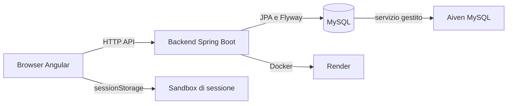

# Architettura

## Scopo

EurCine è un'applicazione full-stack per simulare la gestione di un cinema: il frontend Angular presenta catalogo, programmazione, sale, posti, ordini e area amministrativa; il backend Spring Boot espone le API e persiste i dati su MySQL.

## Confini principali

Il browser usa il backend per le letture. In produzione le operazioni mutative possono essere simulate nella sandbox di sessione del frontend, mentre il filtro backend `ReadOnlyModeFilter` impedisce scritture sul database condiviso.

## Struttura del codice

- `backend/src/main/java/eurcine/backend/controller/` espone gli endpoint REST.
- `backend/src/main/java/eurcine/backend/service/` contiene regole applicative e transazioni.
- `backend/src/main/java/eurcine/backend/repository/` accede al modello JPA e alle proiezioni.
- `frontend/src/app/pages/` contiene le pagine lazy-loaded; `frontend/src/app/core/` contiene guard, interceptor, modelli e servizi.
- `backend/src/main/resources/db/migration/` contiene lo schema e i seed versionati.

## Flussi trasversali

1. Il router Angular carica una pagina e il relativo servizio richiede dati a `/api/...`.
2. Il backend applica CORS e `SecurityFilterChain`, quindi delega dal controller al service e al repository.
3. Le letture arrivano da MySQL; gli ordini verificano programmazione, sala e posti prima della transazione.
4. In produzione le richieste mutative sono bloccate dal backend oppure gestite dalla sandbox browser, senza aggiornare il DB condiviso.

## Fonti

- `backend/src/main/java/eurcine/backend/controller/`
- `backend/src/main/java/eurcine/backend/service/OrdineService.java`
- `backend/src/main/java/eurcine/backend/security/ReadOnlyModeFilter.java`
- `frontend/src/app/app.routes.ts`
- `frontend/src/app/core/service/session-sandbox.service.ts`
- `backend/Dockerfile`
